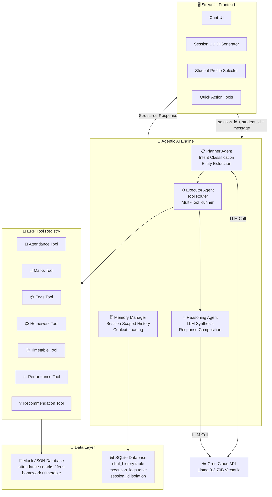

# 🎓 EduPilot AI – Agentic School ERP Assistant

<div align="center">

**An enterprise-grade, intelligent School ERP Assistant powered by Agentic AI**

[](https://python.org)
[](https://fastapi.tiangolo.com)
[](https://streamlit.io)
[](https://groq.com)
[](https://sqlite.org)

</div>

---

EduPilot AI understands natural language student queries, classifies intent, plans execution steps, triggers mock ERP database tools, logs runtime diagnostics, and synthesizes clean responses — all without hallucinations. Built entirely from scratch with **zero LangChain dependencies**.

---

## 🏗️ Architecture Diagram

The backend utilizes a custom **Agentic Planning → Execution → Reasoning** pipeline with multi-user session isolation.


### System Flow (Mermaid)



---

## ✨ Features

| # | Feature | Description |
|---|---------|-------------|
| 1 | 🔍 **Natural Language Search** | Retrieve attendance stats, grade averages, pending homework, or class timetables using plain English |
| 2 | 🔧 **Multi-Tool Execution** | Detects compound requests (e.g., *"Check my midterm marks and show unpaid fees"*), executes multiple database tools, and merges results |
| 3 | 📊 **Academic Performance Summary** | Aggregates attendance logs, grades, and homework statuses into a comprehensive overview |
| 4 | 💡 **Smart Recommendations** | Evaluates student health indicators and compiles actionable tips (warning alerts for overdue fees, low attendance, or bad grades) |
| 5 | 📝 **Exam Study Planner** | Allocates daily preparation hours across subjects based on midterm scores, prioritizing weaker topics |
| 6 | 📅 **Attendance Insights** | Projects whether a student can maintain 90% attendance over a 150-day term with detailed calculations |
| 7 | 🧠 **Conversational Memory** | Retains the last 5 turns of context in SQLite, enabling smooth follow-ups (e.g., *"Which subject scored lowest?"* after *"Show my marks"*) |
| 8 | 🔒 **Multi-User Session Isolation** | UUID-based `session_id` ensures every visitor gets a completely independent chat session — no cross-user data leakage |

---

## 📁 Project Folder Structure

```
EduPilot AI/
├── app/
│   ├── api/
│   │   ├── chat.py             # POST /chat endpoint with session_id isolation
│   │   └── history.py          # GET /chat/history endpoint (session-scoped)
│   ├── agents/
│   │   ├── planner.py          # Agentic query analyzer (intent + entity extraction)
│   │   ├── executor.py         # Tool router and multi-tool runner
│   │   └── reasoning.py        # Final summary composer (LLM synthesis)
│   ├── database/
│   │   ├── database.py         # SQLAlchemy SQLite configuration
│   │   └── models.py           # ChatHistory & ExecutionLog models (with session_id)
│   ├── memory/
│   │   └── memory_manager.py   # Session-scoped conversation history manager
│   ├── prompts/
│   │   ├── system_prompt.py    # Context synthesis instructions with emoji templates
│   │   └── planner_prompt.py   # Intent and entity parsing template
│   ├── schemas/
│   │   ├── request.py          # Pydantic request body (session_id + student_id + message)
│   │   └── response.py         # Pydantic API response specifications
│   ├── services/
│   │   ├── llm_service.py      # Groq client integration
│   │   └── chat_service.py     # End-to-end conversation orchestrator (session-aware)
│   ├── tools/                  # ERP tool implementations (7 tools)
│   ├── utils/
│   │   ├── logger.py           # Console and file-based rotating logger
│   │   └── helpers.py          # Safe JSON loader and performance timers
│   ├── config.py               # Pydantic settings management
│   └── main.py                 # FastAPI application main script
├── frontend/
│   └── streamlit_app.py        # Chat UI with session UUID, collapsible reasoning logs
├── mock_data/
│   ├── generate_mock_data.py   # Populates mock records for 20 students
│   ├── attendance.json
│   ├── marks.json
│   ├── fees.json
│   ├── homework.json
│   └── timetable.json
├── docs/
│   └── architecture_diagram.png
├── logs/                       # Application run logs
├── .env.example                # Configuration sample
├── .gitignore
├── requirements.txt
└── README.md
```

---

## 🚀 Installation & Setup

### 1. Prerequisites
- **Python 3.11+** installed
- **Groq API Key** from [console.groq.com](https://console.groq.com)

### 2. Clone & Install Dependencies
```bash
git clone https://github.com/GNANESWARKOKKIRALA/EduPilot-AI-Agentic-School-ERP-Assistant.git
cd EduPilot-AI-Agentic-School-ERP-Assistant
pip install -r requirements.txt
```

### 3. Configure Environment Variables
```bash
copy .env.example .env
```
Open `.env` and set:
| Variable | Value |
|----------|-------|
| `GROQ_API_KEY` | Your Groq Cloud API Key (`gsk_...`) |
| `GROQ_MODEL` | `llama-3.3-70b-versatile` (default) |

### 4. Populate Mock Database
Initialize mock databases for 20 students (`ST101` → `ST120`):
```bash
python mock_data/generate_mock_data.py
```

---

## ▶️ Running the Application

### 1. Start the FastAPI Backend
```bash
uvicorn app.main:app --reload --host 127.0.0.1 --port 8000
```
- API Server: `http://127.0.0.1:8000`
- Swagger Docs: `http://127.0.0.1:8000/docs`

### 2. Start the Streamlit Frontend
```bash
streamlit run frontend/streamlit_app.py
```
- Web App: `http://localhost:8501`

---

## 📡 API Documentation & Examples

### `POST /chat`
Submits a query to the agentic AI brain. Requires `session_id` for multi-user isolation.

**Request Body:**
```json
{
    "session_id": "550e8400-e29b-41d4-a716-446655440000",
    "student_id": "ST101",
    "message": "Show my midterm marks and check pending fees."
}
```

**Response Payload:**
```json
{
    "intent": "Multi-intent",
    "plan": [
        "Identify student ST101",
        "Load marks database",
        "Load fees database",
        "Calculate midterm averages and dues",
        "Generate consolidated summary"
    ],
    "tool": "Marks Tool, Fees Tool",
    "response": {
        "marks": { "student_name": "Aarav Mehta", "class": "10-A", "exams": { "Midterm": { "Mathematics": 88, "Science": 72 } } },
        "fees": { "pending_fees": 6000, "status": "Pending", "due_date": "2026-07-15" }
    },
    "summary": "You scored an average of 80% on your midterms, with Mathematics being your highest score. You also have ₹6,000 in pending fees due by July 15th.",
    "status": "Pending",
    "execution_time": 1.23
}
```

### `GET /chat/history`
Retrieves session-scoped conversational logs.

| Parameter | Required | Description |
|-----------|----------|-------------|
| `session_id` | ✅ Yes | Unique session identifier (UUID) |
| `student_id` | ❌ No | Filter history by student (e.g. `ST101`) |
| `limit` | ❌ No | Cap number of history records (default: 50, max: 100) |

---

## 🔒 Multi-User Session Isolation

Every browser visitor automatically receives a unique `session_id` (UUID v4):

```
User A opens app → session_id = "abc-1234" → All chats tagged with this ID
User B opens app → session_id = "xyz-5678" → Completely separate history
```

| Layer | How `session_id` is used |
|-------|--------------------------|
| **Frontend** | Generated via `uuid.uuid4()`, stored in `st.session_state` |
| **API Request** | Sent as a required field in `POST /chat` body |
| **Memory Manager** | `SELECT ... WHERE session_id = ?` for history retrieval |
| **Chat History** | `INSERT` includes `session_id` in every record |
| **Execution Logs** | `INSERT` includes `session_id` in every record |
| **History API** | `GET /chat/history?session_id=...` (required parameter) |

---

## 🛣️ Future Improvements

- 🔗 **Live ERP Database Integration** — Connect to real school databases instead of static JSON mock files
- 👥 **Multi-Student Comparison** — Enable teachers to compare performance trends across students
- 📧 **Notifications Hub** — Automatic email alerts for parents when fees are due or attendance drops below 90%
- 🔐 **Authentication** — Add login-based user identity with JWT tokens for production deployments

---

<div align="center">

Built with ❤️ by **Gnaneswar Kokkirala**

</div>
