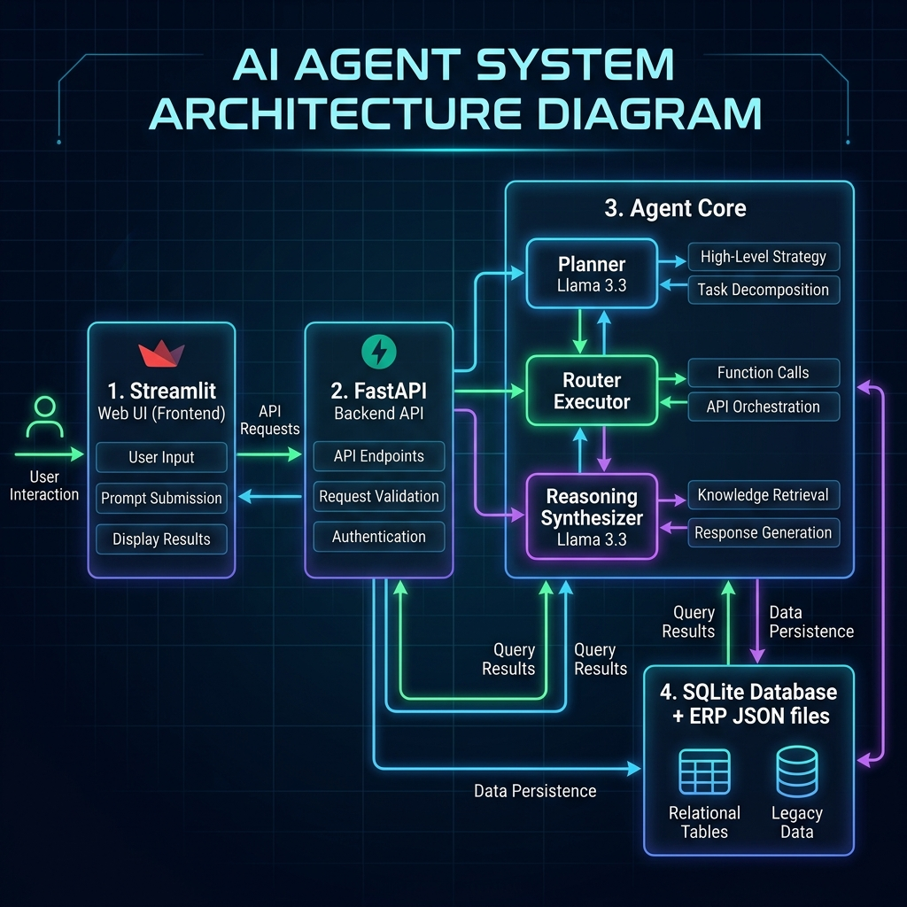

# EduPilot AI – Agentic School ERP Assistant

EduPilot AI is an enterprise-grade, intelligent School ERP Assistant powered by FastAPI (backend), Streamlit (frontend), SQLite (persistent memory), and Llama 3.3 70B Versatile on Groq. It understands natural language student queries, classifies intent, plans execution steps, triggers mock ERP database tools, logs runtime diagnostics, and synthesizes clean responses without hallucinations.

---

## Architecture Diagram

The backend utilizes a custom Agentic Planning and Execution flow (no LangChain dependencies, implemented completely from scratch).



---

## Features

1. **Natural Language Search:** Retrieve attendance stats, grade averages, pending homework, or class timetables.
2. **Multi-Tool Execution:** Detects compound requests (e.g., "Check my midterm marks and show unpaid fees"), executes multiple database tools, and merges results into a single cohesive response.
3. **Academic Performance Summary:** Aggregates attendance logs, grades, and homework statuses.
4. **Smart Recommendations:** Evaluates student health indicators and compiles actionable tips (warning alerts for overdue fees, low attendance projections, or bad grades).
5. **Exam Study Planner:** Programmatically allocates daily preparation hours across subjects based on midterm scores, prioritizing weaker topics.
6. **Attendance Insights:** Projects whether a student can maintain a mandatory 90% attendance rate over a 150-day term, detailing the calculations.
7. **Conversational Memory:** Retains the last 5 turns of conversation context in SQLite, enabling smooth follow-up replies (e.g., "Which subject scored lowest?" after asking "Show my marks").

---

## Project Folder Structure

```
EduPilot AI/
├── app/
│   ├── api/
│   │   ├── chat.py             # POST /chat endpoint with pre-validations
│   │   └── history.py          # GET /chat/history endpoint
│   ├── database/
│   │   ├── database.py         # SQLAlchemy SQLite configuration
│   │   └── models.py           # ChatHistory and ExecutionLog models
│   ├── schemas/
│   │   ├── request.py          # Pydantic request body validation
│   │   └── response.py         # Pydantic API response specifications
│   ├── utils/
│   │   ├── logger.py           # Console and file-based rotating logger
│   │   └── helpers.py          # Safe JSON loader and performance timers
│   ├── prompts/
│   │   ├── system_prompt.py    # Context synthesis instructions
│   │   └── planner_prompt.py   # Intent and entity parsing template
│   ├── agents/
│   │   ├── planner.py          # Agentic query analyzer
│   │   ├── executor.py         # Tool router and multi-tool runner
│   │   └── reasoning.py        # Final summary composer
│   ├── services/
│   │   ├── llm_service.py      # Groq client integration
│   │   └── chat_service.py     # End-to-end conversation orchestrator
│   ├── config.py               # Pydantic settings management
│   └── main.py                 # FastAPI application main script
├── frontend/
│   └── streamlit_app.py        # Chat UI with collapsible reasoning logs
├── mock_data/
│   ├── generate_mock_data.py   # Populates mock records for 20 students
│   ├── attendance.json
│   ├── marks.json
│   ├── fees.json
│   ├── homework.json
│   └── timetable.json
├── logs/                       # Application run logs
├── .env.example                # Configuration sample
├── .gitignore
├── requirements.txt
└── README.md
```

---

## Installation & Setup

### 1. Prerequisites
Ensure you have **Python 3.11** installed.

### 2. Install Dependencies
Clone or copy the directory and run:
```bash
pip install -r requirements.txt
```

### 3. Configure Environment Variables
Copy `.env.example` to `.env`:
```bash
copy .env.example .env
```
Open `.env` and configure your credentials:
- `GROQ_API_KEY`: Set your actual Groq Cloud API Key (`gsk_...`).
- `GROQ_MODEL`: Default is `llama-3.3-70b-versatile`.

### 4. Populate Mock Database
Initialize mock databases for exactly 20 students (`ST101` through `ST120`):
```bash
python mock_data/generate_mock_data.py
```

---

## Running the Application

### 1. Start the FastAPI Backend
Launch the backend server:
```bash
uvicorn app.main:app --reload --host 127.0.0.1 --port 8000
```
The server will start at `http://127.0.0.1:8000`. You can inspect the interactive Swagger API documentation at `http://127.0.0.1:8000/docs`.

### 2. Start the Streamlit Frontend
Launch the user interface:
```bash
streamlit run frontend/streamlit_app.py
```
The Streamlit app will load in your browser at `http://localhost:8501`.

---

## API Documentation & Examples

### `POST /chat`
Submits a query to the agent brain.
- **Request Body:**
  ```json
  {
    "student_id": "ST101",
    "message": "Show my midterm marks and check pending fees."
  }
  ```
- **Response Payload:**
  ```json
  {
    "intent": "Multi-intent",
    "plan": [
      "Identify student ST101",
      "Load marks database",
      "Load fees database",
      "Calculate midterm averages and dues",
      "Generate consolidated summary"
    ],
    "tool": "Marks Tool, Fees Tool",
    "response": {
      "marks": {
        "student_name": "Aarav Mehta",
        "class": "10-A",
        "exams": {
          "Midterm": {
            "Mathematics": 88,
            "Science": 72,
            ...
          }
        }
      },
      "fees": {
        "pending_fees": 6000,
        "status": "Pending",
        "due_date": "2026-07-15"
      }
    },
    "summary": "You scored an average of 80% on your midterms, with Mathematics being your highest score. You also have 6000 INR in pending fees due by July 15th.",
    "status": "Pending",
    "execution_time": 1.23
  }
  ```

### `GET /chat/history`
Retrieves conversational logs.
- **Parameters:**
  - `student_id` (optional): Filter history by student (e.g. `ST101`).
  - `limit` (optional): Cap number of history records.

---

## Future Improvements
- **Live ERP Database Integration:** Connect SQLite tables directly to the backend instead of static JSON mock files.
- **Multi-student Comparison:** Enable teachers to compare performance trends of multiple students.
- **Notifications Hub:** Automatic email alerts for parents when fee due dates are near or attendance falls below 90%.
